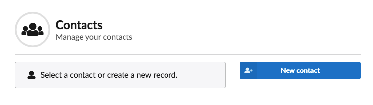
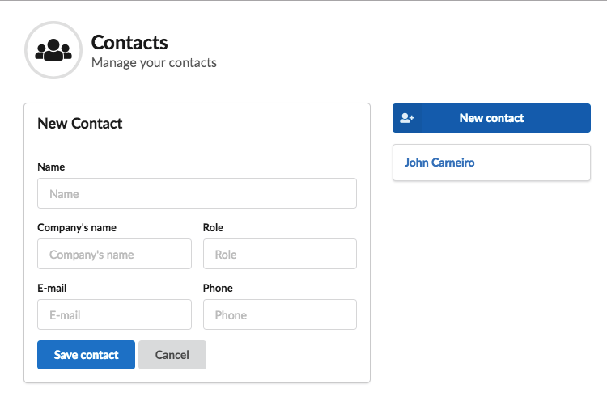
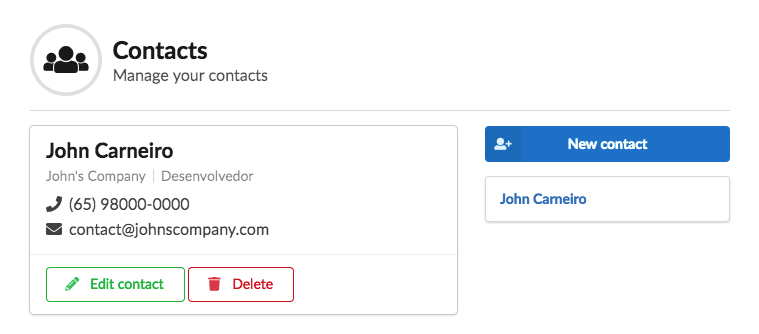
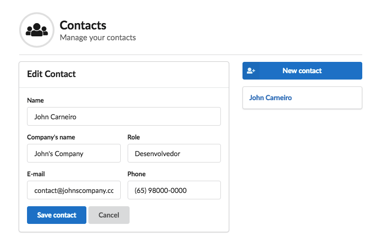

# vue-contact-manager

Project para estudo do Vue.js with Vuex. It's a simple contact manager, data is written to local storage. 

If you want it to be easily integrable with your api, just change the actions to interact with your api.

## Screenshots

#### Index


#### New record


#### Show record


#### Edit record


## Requirements

- Node
- NPM or Yarn

## Dependencies

- vue (2.5.21)
- vue-router (3.0.1)
- vuex (3.0.1)
- vuex-persistedstate (2.5.4)
- semantic-ui-css (2.4.1)
- semantic-ui-vue (0.7.0)

## Project setup
```
npm install
```

### Compiles and hot-reloads for development
```
npm run serve
```

### Compiles and minifies for production
```
npm run build
```

### Run your tests
```
npm run test
```

### Lints and fixes files
```
npm run lint
```
